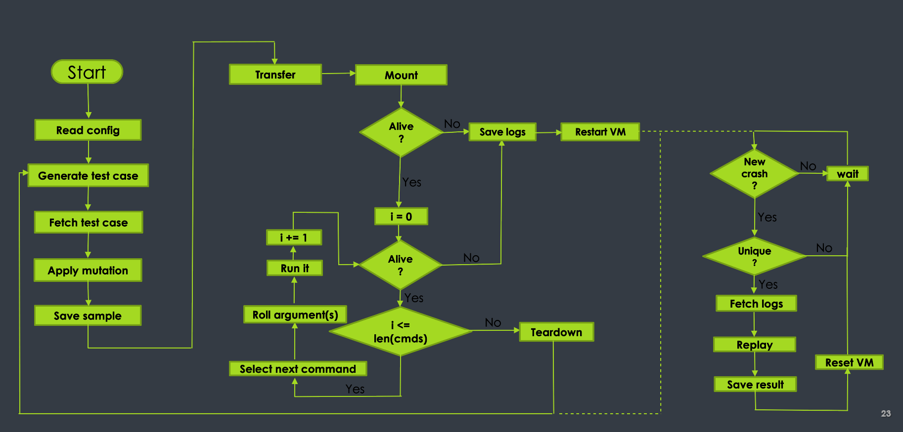
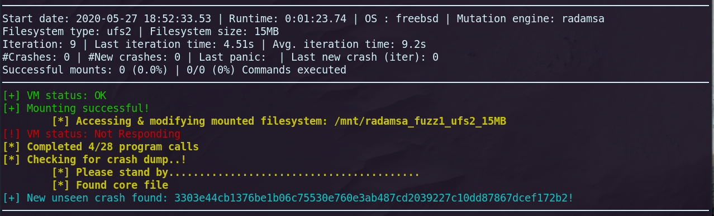

# FI(le) SY(stem) - FUZZer


This is the full file system fuzzing framework that I presented at the Hack in the Box 2020 Lockdown Edition conference in April.

 * [Conference Talk](https://youtu.be/VNzKVOsn5qQ?t=17032)
 * [Conference Material](https://github.com/0xricksanchez/HITB2020_FSFUZZER)





## Goal

The goal of this framework is to uncover kernel security bugs on UNIX systems with a strong focus on BSD systems.
It was developed and heavily tested against FreeBSD, OpenBSD, and NetBSD but also already has some minor support for Linux based Hosts.
We were able to successfully uncover over 100 unique kernel bugs for UFS and EXT based file systems while also getting
a lot of insight into the recent addition of ZFS.

### Test case generator

The `makeFS2.py` can be used as a standalone utility to generate different valid file systems.
The usage is explained in detail in the [conference material repo](https://github.com/0xricksanchez/HITB2020_FSFUZZER)

## Requirements

The framework was solely tested on Ubuntu 18.04.
It relies on KVM, QEMU and libvirt.
The `Requirements.sh` sets up all necessary dependencies.
The framework may be fully functional on the latest Ubuntu 20.04 release.
Other non `apt` based host system should be easily supported and only requires minor changes in the `Requirements.sh`.
Once you're done with the requirements you can continue with the setup steps!

## Setup

Refer to the [SETUP.md](SETUP.md). If some steps are unclear please reach out!

## Fuzz it!

Starting the fuzzer only requires executing: `python3 run.py`.
Depending on your setup you may require `sudo` privileges.
When everything started successfully you can attach to the tmux fuzzing session via:

```
(sudo) tmux attach-session -t fsfuzzer
```

### Config

The framework can be configured with the script `src/config/fuzzing_config.py`:

```python

# [fuzzing task specs]
# List of dictionaries specifying each fuzzing instance
fuzzer = [
    {
        "name": "fuzz1",  # Some name for internal bookkeeping
        "fs_creator_vm": "genBox",  # Name as specified in libvirt for the VM handling the file system generation, can be the same across all instances
        "fuzzing_vm": "fuzzBox_0",  # Name as specified in libvirt for the VM handling the file system generation
        "mutation_engine": "radamsa, 0",  # Mutation Engine that is to be used, and size of mutation (radamsa takes no size argument)
        "target_fs": "ufs2",  # Target file system
        "target_size": 15,  # Max file system size in Megabyte
        "populate_with_files": 10,  # Amount of file that will be generated
        "max_file_size": 1024,  # Maximum file size in bytes for each generated file
        "enable_dyn_scaling": False,  # Dynamic scaling will increase the filesystem size periodically
    },
]

# [credentials]
# Credentials for the root user for the VMs
# It is expected that these are the same across all instances, but not necessarily root
user = "root"
pw = "root"
```

The available mutation engines are:

 - radamsa
 - byte_flip_seq
 - byte_flip_rnd
 - metadata
 
Dynamic scaling was initially implemented to test whether the size of a file system affects the possible crashes.
I was not able to identify a trigger value for file system size where crashes change, so this flag can stay disabled.
This also prevents suffering from a performance drop on longer runs as larger file systems take longer to mutate.

The remaining config parameters should be self explanatory.

### PoC

The video below shows a quick demo where two fuzzing instances both targeting FreeBSD with a radamsa mutated UFS2 and a random bytes flipped EXT file system.
The mutated UFS file system directly leads to a crash showcasing how quickly you can crash a kernel.

[](https://asciinema.org/a/ABgNGFLU3TrUe4n7gOcduTrGk)




## Feature set

- [X] Full Support for FFS, UFS, EXT, and ZFS file systems
- [X] Full support for FreeBSD, NetBSD, and OpenBSD
    - [X] Experimental support for Ubuntu (and probably other Debian based derivatives)
- [X] Mutations via 
    - [X] radamsa
    - [X] global random byte flips
    - [X] global random byte sequence changes
    - [X] superblock only changes
- [X] Fully randomized user emulation to access/change broken but mounted file system
- [X] Crash database
- [X] Crash Verification
- [X] VM reset via snapshots
- [X] Fully automated fuzzing process
- [X] Reasonable user interface on the commandline

## Future Work

- [ ] Support more/different mutation engines
- [ ] Automated VM setup
- [ ] Check for available snapshots and if missing take some before fuzzing
- [ ] Support for macOS
- [ ] Performance tweaks
  - [ ] Make framework async
    - [ ] Continuous sample creation w/o waiting for fuzzing run
  - [ ] Use same sample with different mutations before generating a new one
  - [ ] Rework algorithms/interactions for speedup
- [ ] Code cleanup & refactoring
  - [ ] Make logging verbosity togglable


## [Trophies](https://www.freshbsd.org/search?q=Christopher+Krah&sort=commit_date)

With this setup I was able to find > 100 hundred unique kernel bugs in FreeBSD, NetBSD and OpenBSD for UFS and EXT based file systems.
Among these crashes I had a bunch of very interesting ones:

- Out of bounds reads
- Out of bounds writes
- Double Fault in EXT
- Triple Fault in UFS
- Non-deterministic kernel bug with > 6 unique core dumps

The majority of crashes were kernel DoS.
Furthermore, the majority of encountered crashes are still not fixed as of today (May 2020).
So have a go at finding kernel bugs in file system implementations :).

## Disclaimer

This whole thing was built with 'trust driven development', meaning that it grew way too large way too quick from a sole PoC idea.
Hence, there are no tests either and most likely a few bugs. 
I'm sorry if you run into crashes (that are not kernel panic related) but feel free to make a PR or hit me up and I'll fix things ASAP!

## Contact

Twitter: [@0xricksanchez](https://twitter.com/0xricksanchez)
